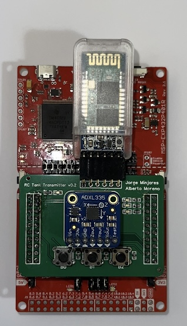
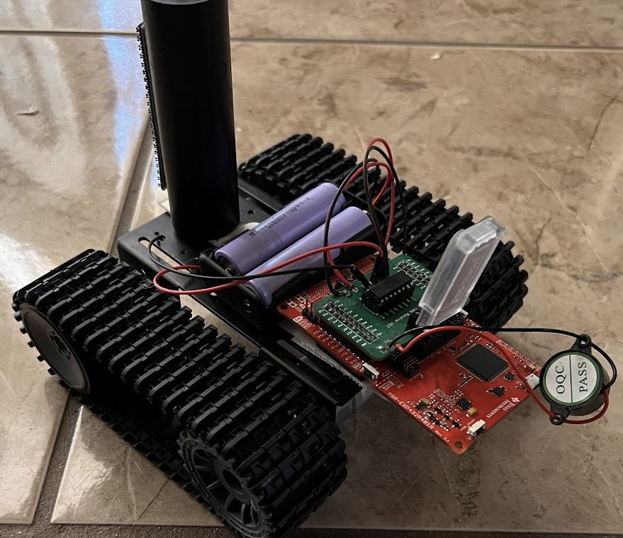

# Microprocessors' Final Project :zap:

## **Description**
This repository will contain the design for the Microprocessor (EE3376) Final Project. The Final Project is an Rmote Controlled (RC) car commanded via hand movements. This is achieved by communicating two bluetooth modules acting as the master (Transmitter) and the slave (Receiver).

## **Requirements**
- [x] General Purpose Input and Output (GPIO) 
    - Buttons
    - LEDs
- [x] Software Timer
- [x] Universal Asynchronous Receiver and Transmitter (UART)
- [x] Analog-to-Digial Converter (ADC)
- [x] Pulse Width Modulation (PWM)
## **Features**
- [x] Designed custom 2-layer Printed Circuit Board (PCB) booster pack to reduced hardware use
- [x] Use HC-05 Bluetooth modules to establish communication between the Receiver and Transmitter
## **Table of Contents**
- [Hardware Design (PCB)](https://github.com/JorgeMinjares/MicroprocessorsFinalProject/tree/main/Hardware)
- [Software Design](https://github.com/JorgeMinjares/MicroprocessorsFinalProject/tree/main/Software)
## **Final Design**
### **Transimitter**

### **Receiver**

## **Author:**
* [**Jorge Minjares** :zap:](https://github.com/JorgeMinjares) 
  * Bachelor of Science in Electrical Engineering 
 
 